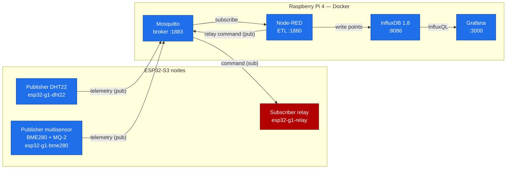
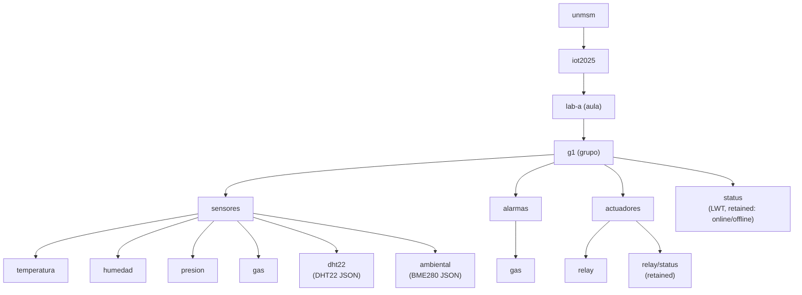

# IoT MQTT telemetry stack — UNMSM

> End-to-end MQTT telemetry pipeline for an ESP32 + Raspberry Pi IoT lab: ESP32-S3 sensors publish to a Mosquitto broker, Node-RED performs ETL into InfluxDB, and Grafana visualizes it — all from a single `docker compose up -d`.


This repository is a coursework deliverable for **UNMSM — Internet de las Cosas (IoT)**,
MQTT laboratory. It is portfolio-grade but stays faithful to the official lab guide:
the topic namespace, QoS table, InfluxDB schema, and Node-RED logic are kept exactly as
specified.

## Overview

A classroom of ESP32-S3 boards measures the environment (temperature, humidity,
pressure, combustible gas) and publishes readings over **MQTT** to a broker running on a
**Raspberry Pi 4**. **Node-RED** subscribes, transforms the JSON, and writes time-series
points into **InfluxDB**. **Grafana** renders live dashboards. A second ESP32-S3
subscribes to the broker and drives a **relay**, so commands flow *back down* the
pipeline — a fully bidirectional system.

The entire backend is four Docker containers on one host. Because every image is
published as a **multi-arch manifest (amd64 + arm64)**, the *same* `docker-compose.yml`
runs unchanged on the classroom **Raspberry Pi 4 (arm64)** and on an **x86_64 Arch Linux**
dev machine. See [Multi-arch & portability](#multi-arch--portability).

## Architecture



Telemetry travels **up** (sensors → broker → ETL → DB → dashboards); commands travel
**down** (Node-RED → broker → relay).

### Component roles

| Service | Role | Port | Image |
|---------|------|------|-------|
| **Mosquitto** | MQTT broker — the central Pub/Sub message router and hub. Every node connects here. | `1883` | `eclipse-mosquitto:2` |
| **Node-RED** | Flow-based ETL (Node.js). Subscribes to MQTT, parses JSON, writes to InfluxDB, holds the alarm/automation logic. | `1880` | `nodered/node-red:3.1` (+ `node-red-contrib-influxdb`) |
| **InfluxDB** | Time-series database (measurement / tags / fields / timestamp). | `8086` | `influxdb:1.8` |
| **Grafana** | Read-only dashboards and alerting over InfluxDB. | `3000` | `grafana/grafana:10.4.5` |

## Topic hierarchy

The namespace is fixed by the lab guide (defaults `aula=lab-a`, `grupo=g1`):

```
unmsm/iot2025/<aula>/<grupo>/sensores/<tipo>
```



Full topic list:

| Topic | Payload | Notes |
|-------|---------|-------|
| `unmsm/iot2025/lab-a/g1/sensores/temperatura` | value | DHT22 |
| `unmsm/iot2025/lab-a/g1/sensores/humedad` | value | DHT22 |
| `unmsm/iot2025/lab-a/g1/sensores/presion` | value | BME280 |
| `unmsm/iot2025/lab-a/g1/sensores/gas` | value | MQ-2 (after warm-up) |
| `unmsm/iot2025/lab-a/g1/sensores/dht22` | JSON | consumed by Node-RED → InfluxDB |
| `unmsm/iot2025/lab-a/g1/sensores/ambiental` | JSON | BME280 temp/hum/pressure |
| `unmsm/iot2025/lab-a/g1/alarmas/gas` | `ALERT` | gas threshold crossed |
| `unmsm/iot2025/lab-a/g1/actuadores/relay` | `ON`/`OFF` | relay command |
| `unmsm/iot2025/lab-a/g1/actuadores/relay/status` | `ON`/`OFF` | **retained** |
| `unmsm/iot2025/lab-a/g1/status` | `online`/`offline` | **LWT, retained** |

### Wildcards

MQTT subscriptions can use two wildcards (handy for debugging with `mosquitto_sub`):

- `+` — **single level**. `unmsm/iot2025/lab-a/g1/sensores/+` matches every sensor topic.
- `#` — **multi level** (must be last). `unmsm/iot2025/lab-a/g1/#` matches everything for the group.

## Quality of Service (QoS)

| QoS | Name          | Use case                       |
|-----|---------------|--------------------------------|
| 0   | At most once  | Temperature/humidity readings  |
| 1   | At least once | Gas alarm / thresholds         |
| 2   | Exactly once  | Actuator (relay) commands      |

> ⚠️ **Publisher-side caveat.** The firmware uses **PubSubClient**, whose `publish()`
> has no QoS argument — it always publishes at **QoS 0**. So the "gas alarm at QoS 1"
> target applies to **subscriptions** only (the relay node subscribes at QoS 1). For
> true at-least-once *publishing*, swap in
> [256dpi/arduino-mqtt](https://github.com/256dpi/arduino-mqtt). See
> [`firmware/README.md`](./firmware/README.md).

## Hardware & wiring

ESP32-S3 board with the classroom sensor kit:

| Sensor / Actuator | Pin / Bus | ESP32-S3 GPIO | Notes |
|-------------------|-----------|---------------|-------|
| DHT22             | VCC       | 3.3V          | |
|                   | DATA      | GPIO4         | 10 kΩ pull-up to 3.3V |
|                   | GND       | GND           | |
| BME280 (I2C 0x76) | VCC       | 3.3V          | |
|                   | GND       | GND           | |
|                   | SCL       | GPIO22        | |
|                   | SDA       | GPIO21        | |
| MQ-2              | VCC       | 5V (VIN)      | heater requires 5V |
|                   | GND       | GND           | |
|                   | AO        | GPIO36 (ADC)  | analog gas level |
|                   | DO        | GPIO35        | digital threshold |
| Relay (4-ch)      | IN        | GPIO26        | **active-LOW**; init HIGH in `setup()` to avoid a spurious trigger |

## Prerequisites

- **Docker Engine** + **Docker Compose v2** (`docker compose`, not `docker-compose`).
- Host: **Raspberry Pi OS 64-bit** on the Pi, or any x86_64 Linux (tested on Arch).
- All four images are multi-arch, so no per-architecture changes are required.
- For the firmware: the **Arduino IDE** with the ESP32 board package.

## Quick start

```bash
# 1. Clone
git clone https://github.com/<your-user>/iot-mqtt-stack.git
cd iot-mqtt-stack

# 2. Create your environment file (git-ignored)
cp .env.example .env
#   On the Raspberry Pi, set DATA_PATH to your USB SSD mount, e.g.
#   DATA_PATH=/mnt/ssd/iot-data

# 3. Bring the whole stack up (builds the Node-RED image on first run)
docker compose up -d

# 4. Check everything is healthy
docker compose ps
```

Access the services **by the Raspberry Pi's LAN IP** from classroom laptops
(find it on the Pi with `hostname -I`, e.g. `192.168.1.100`):

| Service | URL |
|---------|-----|
| Node-RED editor | `http://<rpi-ip>:1880` |
| Grafana | `http://<rpi-ip>:3000` (default `admin` / `admin`) |
| InfluxDB API | `http://<rpi-ip>:8086` |
| MQTT broker | `<rpi-ip>:1883` |

The Grafana dashboard **"Lab IoT UNMSM – Grupo g1"** and the InfluxDB datasource are
auto-provisioned; the Node-RED flows are auto-loaded. The stack is ready to receive data
the moment the ESP32 sketches start publishing.

Quick smoke test from any machine on the LAN (no hardware needed):

```bash
mosquitto_pub -h <rpi-ip> -t unmsm/iot2025/lab-a/g1/sensores/dht22 \
  -m '{"dispositivo":"esp32-g1-dht22","temperatura":24.5,"humedad":55.0}'
```

Then watch it land in Grafana, or tail all group traffic:

```bash
mosquitto_sub -h <rpi-ip> -t 'unmsm/iot2025/lab-a/g1/#' -v
```

## Configuration

All tunables live in `.env` (copied from `.env.example`):

| Variable | Default | Purpose |
|----------|---------|---------|
| `DATA_PATH` | `./data` | Host path for all persistent volumes. **On the Pi, point this at a USB SSD** (`/mnt/ssd/iot-data`) to avoid SD-card wear. On Arch, the default is fine. |
| `TZ` | `America/Lima` | Container timezone (log + Grafana timestamps). |
| `INFLUXDB_DB` | `iot_lab` | Auto-created InfluxDB database. |
| `GF_SECURITY_ADMIN_USER` / `_PASSWORD` | `admin` / `admin` | Grafana admin login — change before any non-LAN use. |

Persistent data is laid out under `${DATA_PATH}`:

```
${DATA_PATH}/
├── mosquitto/{data,log}
├── node-red/
├── influxdb/
└── grafana/
```

### Multi-arch & portability

The committed `docker-compose.yml` is the **single source of truth** and runs unchanged
on both architectures because every pinned image ships amd64 **and** arm64 variants.
Anything host-specific (SSD paths, memory limits, extra port bindings) goes in
`docker-compose.override.yml`, which Compose merges automatically:

```bash
cp docker-compose.override.yml.example docker-compose.override.yml
# edit as needed — this file is git-ignored
```

## InfluxDB schema

Written by the Node-RED telemetry flow (names match the guide — do not rename):

| Element | Value |
|---------|-------|
| database | `iot_lab` |
| measurement | `sensor_dht22` |
| tags | `dispositivo`, `aula` (`lab-a`), `grupo` (`g1`) |
| fields | `temperatura`, `humedad` |

## Node-RED flows

Two flows ship in [`node-red/flows.json`](./node-red/flows.json) and load
automatically. Inside Docker, Node-RED reaches the broker at **`mosquitto:1883`** and
InfluxDB at **`influxdb:8086`** (service names, never `localhost`).

- **Flow 1 — telemetry persistence:**
  `mqtt in (sensores/dht22)` → `json` → `function` → `influxdb batch (iot_lab)` → `debug`.
  The function emits an array of `{ measurement, tags, fields }` points, which the
  `influxdb batch` node writes (each point carries its own measurement).
- **Flow 2 — gas alarm automation:**
  `mqtt in (alarmas/gas)` → `switch (alerta?)` → `function (payload="ON")` →
  `mqtt out (actuadores/relay)` → notification.

Details and the verbatim function-node code are in
[`node-red/README.md`](./node-red/README.md).

## Grafana

- **Datasource:** InfluxDB (InfluxQL), `url: http://influxdb:8086`, `database: iot_lab`
  ([`grafana/provisioning/datasources/influxdb.yml`](./grafana/provisioning/datasources/influxdb.yml)).
- **Dashboard:** *Lab IoT UNMSM – Grupo g1*
  ([`grafana/provisioning/dashboards/lab-iot-unmsm.json`](./grafana/provisioning/dashboards/lab-iot-unmsm.json))
  with a Temperature time-series panel, a Humidity time-series panel, and a Stat panel
  for the latest temperature. The temperature panel carries a **red visual threshold at
  28 °C**.

Temperature panel query (verbatim):

```sql
SELECT mean("temperatura") FROM "sensor_dht22"
WHERE $timeFilter
GROUP BY time($__interval) fill(none)
```

## Security

The committed configuration is the **classroom LAN profile**: the broker allows
**anonymous** connections so any ESP32 or laptop on the lab network can join without
credentials. This matches the guide and is appropriate for an isolated classroom LAN.

```conf
listener 1883
allow_anonymous true
log_type all
log_dest stdout
```

### Production hardening (optional)

For any deployment beyond the isolated lab, harden the broker:

1. **Require authentication** — generate a password file and disable anonymous access:

   ```bash
   docker compose exec mosquitto \
     mosquitto_passwd -c /mosquitto/config/passwd g1
   ```

   ```conf
   allow_anonymous false
   password_file /mosquitto/config/passwd
   ```

2. **Enable TLS** on port **8883** with a server certificate:

   ```conf
   listener 8883
   cafile   /mosquitto/config/certs/ca.crt
   certfile /mosquitto/config/certs/server.crt
   keyfile  /mosquitto/config/certs/server.key
   ```

3. Change the Grafana admin password and put InfluxDB behind auth
   (`INFLUXDB_HTTP_AUTH_ENABLED=true` + a created admin user).

These are documented as a hardening path; the default committed config stays
LAN/anonymous to match the lab.

## Firmware

Three complete, compilable ESP32-S3 sketches under [`firmware/`](./firmware):

- [`publisher-dht22`](./firmware/publisher-dht22) — DHT22 temp/humidity + JSON, LWT.
- [`publisher-multisensor`](./firmware/publisher-multisensor) — BME280 environmental
  JSON + MQ-2 gas/alarm with a **non-blocking ~20 s warm-up** (no `delay(20000)`).
- [`subscriber-relay`](./firmware/subscriber-relay) — subscribes to relay commands at
  QoS 1, drives an active-LOW relay, no blocking delays in `loop()`.

Libraries: WiFi, PubSubClient, DHT sensor library (Adafruit), Adafruit_BME280,
ArduinoJson. Credentials live in a **git-ignored** `arduino_secrets.h` (copied per
sketch from `arduino_secrets.example.h`); the only tracked secrets file has empty
values. Remember the **PubSubClient QoS-0** caveat above. Full setup:
[`firmware/README.md`](./firmware/README.md).

## Lab activities

| Activity | What it covers | Where in the repo |
|----------|----------------|-------------------|
| **1** | Publish DHT22 telemetry over MQTT with LWT/retained status | `firmware/publisher-dht22/` |
| **2** | Multisensor (BME280 + MQ-2), JSON, gas alarm, non-blocking warm-up | `firmware/publisher-multisensor/` |
| **3** | Subscribe + actuate: relay driven by broker commands (QoS 1 sub) | `firmware/subscriber-relay/` |
| **4** | Persist & visualize: Node-RED → InfluxDB → Grafana dashboard | `node-red/`, `grafana/`, `docker-compose.yml` |

## Project structure

```
iot-mqtt-stack/
├── README.md
├── LICENSE                       # MIT
├── .gitignore                    # ignores .env, arduino_secrets.h, data/
├── .env.example
├── docker-compose.yml            # one file, both architectures
├── docker-compose.override.yml.example
├── mosquitto/
│   └── config/mosquitto.conf     # LAN/anonymous profile
├── node-red/
│   ├── Dockerfile                # base 3.1 + node-red-contrib-influxdb
│   ├── flows.json                # auto-loaded: persistence + gas alarm flows
│   └── README.md
├── grafana/
│   └── provisioning/
│       ├── datasources/influxdb.yml
│       └── dashboards/
│           ├── dashboards.yml
│           └── lab-iot-unmsm.json
├── influxdb/.gitkeep
├── firmware/
│   ├── publisher-dht22/publisher-dht22.ino
│   ├── publisher-multisensor/publisher-multisensor.ino
│   ├── subscriber-relay/subscriber-relay.ino
│   ├── arduino_secrets.example.h
│   └── README.md
└── docs/.gitkeep
```

## Troubleshooting

**Grafana or Node-RED restart in a loop / `localhost:3000` won't load.**
The Docker daemon creates missing bind-mount targets under `${DATA_PATH}` as `root`,
but Grafana runs as uid `472` and Node-RED as uid `1000` and cannot write there. The
logs show `GF_PATHS_DATA ... is not writable` or `EACCES ... copyfile ... /data/settings.js`.
Fix the ownership of the affected data directories (no host `sudo` needed — use a
throwaway root container) and bring the stack back up:

```bash
docker compose down
docker run --rm -v "$(pwd)/data:/data" alpine sh -c \
  'chown -R 472:472 /data/grafana && chown -R 1000:1000 /data/node-red'
docker compose up -d
docker compose ps        # all four should report (healthy)
```

InfluxDB and Mosquitto run as root and are unaffected. If you relocate `DATA_PATH`
(e.g. to a USB SSD), apply the same `chown` to the new location once.

## Roadmap

- [ ] Migrate firmware to `256dpi/arduino-mqtt` for true QoS-1 publishing.
- [ ] Add Grafana alerting (email/Telegram) on the 28 °C and gas thresholds.
- [ ] Add OTA firmware updates for the ESP32 nodes.
- [ ] Provide a hardened compose profile (auth + TLS) as `docker-compose.secure.yml`.
- [ ] Add per-group dashboards and InfluxDB retention policies.

## License

Released under the [MIT License](./LICENSE).
